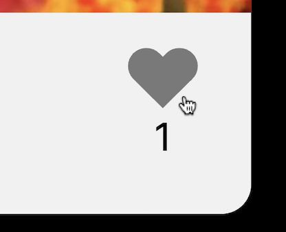
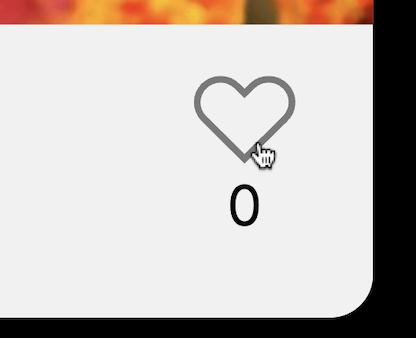

### Тест-кейс: Дизлайк

**Предусловие:**
- открыта страница https://olhasmy.github.io/mesto
- на странице есть добавленное изображение
- на изображении стоит лайк

**Шаги:**

1. Навести курсор на иконку лайка любого залайканного изображения

   **Ожидаемый результат:**

    - курсор изменился на указатель
    - иконка лайка меняет цвет на hover
       

2. Нажать на лайк

   **Ожидаемый результат:**

    - лайк удалился и окрасился белым
    - каунтер под иконкой лайка уменьшился на -1
       
