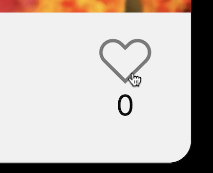

### Тест-кейс: Лайк

**Предусловие:**
- открыта страница https://olhasmy.github.io/mesto
- на странице есть добавленное изображение

**Шаги:**

1. Навести курсор на иконку лайка любого незалайканного изображения

   **Ожидаемый результат:**

   - курсор изменился на указатель
   - иконка лайка меняет цвет на hover
      

2. Нажать на лайк

   **Ожидаемый результат:**

   - лайк прожался и окрасился черным
   - каунтер под иконкой лайка увеличился на +1
      
