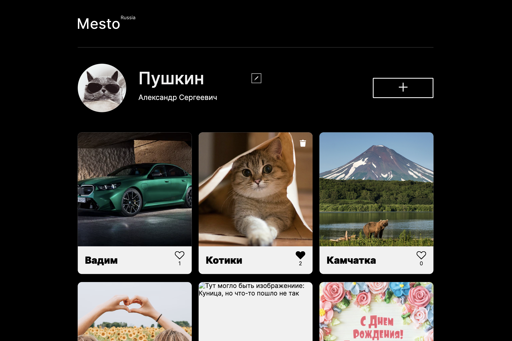
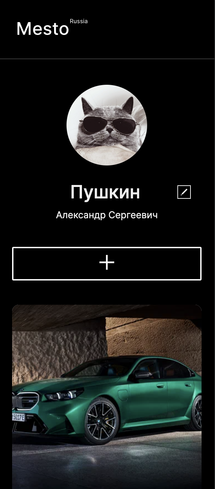

### Тест-кейс: UI главной страницы

**Предусловие:**
- открыта страница https://olhasmy.github.io/mesto

**Шаги:**

1. Разрешение экрана 1280px

   **Ожидаемый результат:**
   - страница соответствует скриншоту:
      

3. Разрешение экрана 320px

   **Ожидаемый результат:**
   - страница соответствует скриншоту:
      
